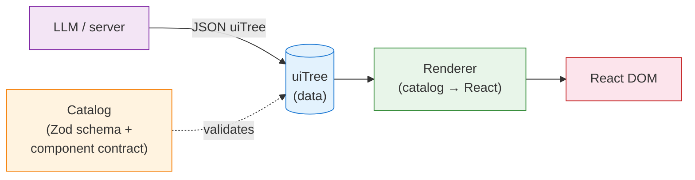

# UiTree examples

The goal of uiTree is to enable server-driven UI. This also makes it possible to create the UI using generative AI. The uiTree has a strict zod schema which is constructed from all the available components in the component catalogue. The LLM can be instructed to use structured output according to the uiTree schema. Instead of emitting prose, the final LLM output is structured data conforming to the uiTree schema.

When the UI receives the uiTree satisfying the schema it knows how to render and has components for, it uses a uiTree renderer.



## Run it

```bash
pnpm install
pnpm dev            # http://localhost:5173
pnpm build          # production bundle
pnpm preview        # serve the bundle
pnpm type-check
pnpm lint
```

## The two contract functions

`@kopai/ui` provides the two functions needed to build a renderer:

1. `createCatalog` — define the components and their props. The returned `uiTreeSchema` is a Zod schema that any valid tree must satisfy.
2. `createRendererFromCatalog` — bind each catalog entry to a React component.

```typescript
const catalog = createCatalog({
  name: "hello world catalog",
  components: {
    PlainText: {
      description: "displays static textual content",
      hasChildren: false,
      props: z.object({ content: z.string() }),
    },
  },
});

const Renderer = createRendererFromCatalog(catalog, {
  PlainText: ({ element }) => <p>{element.props.content}</p>,
});

<Renderer tree={uiTree} />;
```

A valid `uiTree` for the catalog above — a flat map of elements keyed by `key`, with `root` pointing at the entry point:

```ts
const uiTree = {
  root: "hello",
  elements: {
    hello: {
      key: "hello",
      type: "PlainText" as const,
      parentKey: "",
      children: [],
      props: { content: "Hello, uiTree" },
    },
  },
} satisfies z.infer<typeof catalog.uiTreeSchema>;
```

### Catalog entry fields

- `props` — Zod schema for the component's props.
- `hasChildren` — `true` → renderer receives `children: ReactNode` and must render them; `false` → leaf.
- `description` — surfaced to the prompt generator for LLMs.
- `acceptsDataFrom` _(optional)_ — list of SDK method names this component accepts as a `dataSource`. If present, the component opts into data-fetching (see below).

## dataSource + the `hasData` branch

A tree element may carry a `dataSource`:

```ts
{ type: "MetricStat", dataSource: {
    method: "searchAggregatedMetrics",
    params: { metricType: "Sum", metricName: "...", aggregate: "sum" },
  }, ... }
```

When present, the renderer wrapper fetches data via `@tanstack/react-query` and calls your component with `hasData: true` plus `response`, `loading`, `error`, `refetch`, `updateParams`. When absent, it calls with `hasData: false` and just props. Renderer signature to branch on:

```tsx
function MyRenderer(props: RendererProps<"MyComponent">) {
  if (!props.hasData) return <Placeholder />;
  // props.loading / props.error / props.response are available here
}
```

Components that accept more than one method (`MetricStat`, `TraceDetail`) produce a union of response shapes — narrow with a `dataSource.method === "..."` type guard. See the `isAggregatedMetricStat` / `isTraceSummaries` guards in [`src/custom-observability-catalog.tsx`](src/custom-observability-catalog.tsx).

Data-fetching requires a `KopaiSDKProvider` ancestor. Instantiate a `KopaiClient` once and wrap the renderer:

```tsx
const kopaiClient = new KopaiClient({ baseUrl: "/kopai-api" });

<KopaiSDKProvider client={kopaiClient}>
  <Renderer tree={tree} />
</KopaiSDKProvider>;
```

### Pitfalls

- **`as const` on discriminators.** Tree literals need `type: "Foo" as const` and `dataSource.method: "..." as const` for `satisfies UITree` to narrow the discriminated union. Without them TS widens to `string` and the `satisfies` check fails with a cryptic union-mismatch error.
- **Method-specific params.** `dataSource` is a Zod discriminated union on `method` — each method has its own `params` schema. Wrong shape = compile error. Example: `searchTraceSummariesPage` requires `sortOrder: "ASC" | "DESC"` (there's a schema default, but the output type treats it as required).
- **`acceptsDataFrom` is a contract, not a switch.** A component can render without a `dataSource` even when `acceptsDataFrom` is set — the `hasData: false` branch is always reachable, so your renderer must handle it.

### Vite dev-proxy

The examples target `https://demo.kopai.app` without CORS headaches by routing through a Vite dev proxy. `KopaiClient` uses a relative `baseUrl: "/kopai-api"`, and [`vite.config.ts`](vite.config.ts) forwards that prefix to the demo host. Copying this pattern is usually the simplest way to talk to a backend from a local dev setup.

## Examples

### 1. [`src/static-data.tsx`](src/static-data.tsx)

The simplest possible uiTree — a local catalog of `PlainText` + `Stack`, a hardcoded tree, no data fetching. Start here.

### 2. [`src/dynamic-kopai-data.tsx`](src/dynamic-kopai-data.tsx)

Same local-catalog pattern, but adds a `MetricStat` component with `acceptsDataFrom: ["searchAggregatedMetrics"]` and wraps the renderer in `KopaiSDKProvider`. Minimum viable dynamic tree.

### 3. [`src/custom-observability-catalog.tsx`](src/custom-observability-catalog.tsx)

Reference implementation for the full `observabilityCatalog` exported from `@kopai/ui` — all 15 components (8 primitives + 7 data-backed), a shared `<RequestState>` helper, multi-method type-guard narrowing, and a kitchen-sink tree that exercises every renderer. Read this as the authoritative example for building a custom renderer set. Canonical catalog definitions (Zod schemas for each component's `props` + `acceptsDataFrom`) live at [`packages/ui/src/lib/observability-catalog.ts`](../../packages/ui/src/lib/observability-catalog.ts).

## Feature-complete reference

The renderers in this package are intentionally minimal. For production-grade implementations with charts, virtual scroll, drill-downs, etc., see [`packages/ui/src/components/observability/renderers/`](../../packages/ui/src/components/observability/renderers/) in the repo.
