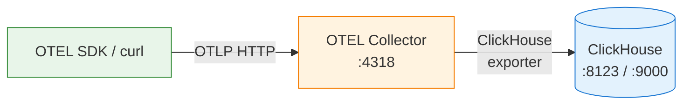
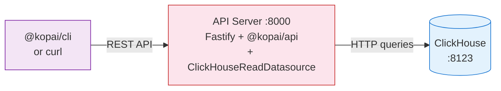
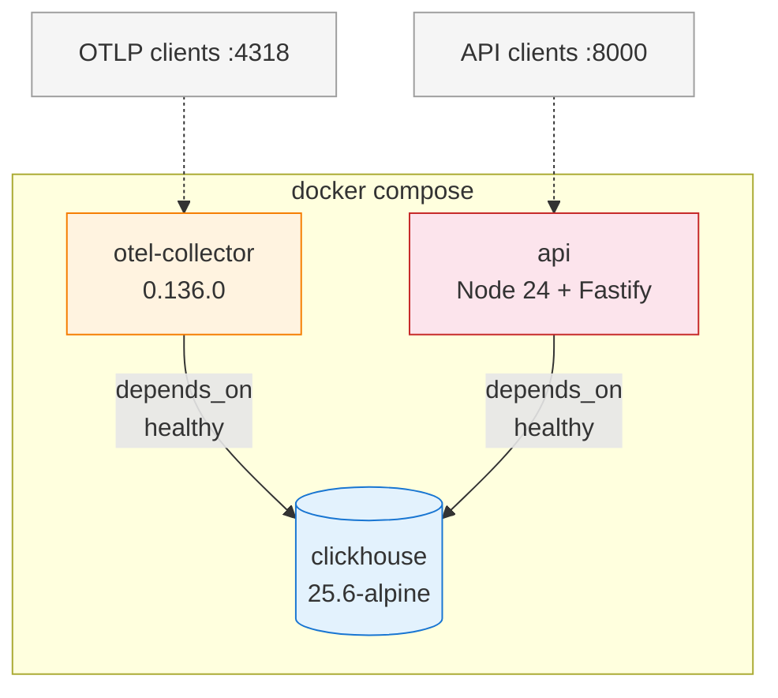

# ClickHouse Observability Backend

Runs the full OTEL → ClickHouse → API pipeline locally via Docker Compose.

## Architecture

### Data Ingestion



### Data Query



### Docker Compose Services



## Start

```bash
cd packages/clickhouse-datasource/examples/clickhouse-observability-backend
docker compose up --build
```

Wait for all 3 services to be healthy.

## Send test data

### Traces

```bash
NOW=$(date +%s) && curl -X POST http://localhost:4318/v1/traces \
  -H 'Content-Type: application/json' \
  -d "{
    \"resourceSpans\": [{
      \"resource\": {
        \"attributes\": [{\"key\": \"service.name\", \"value\": {\"stringValue\": \"demo-service\"}}]
      },
      \"scopeSpans\": [{
        \"scope\": {\"name\": \"demo-scope\"},
        \"spans\": [{
          \"traceId\": \"0af7651916cd43dd8448eb211c80319c\",
          \"spanId\": \"b7ad6b7169203331\",
          \"name\": \"GET /api/demo\",
          \"kind\": 2,
          \"startTimeUnixNano\": \"${NOW}000000000\",
          \"endTimeUnixNano\": \"${NOW}005000000\",
          \"status\": {\"code\": 1}
        }]
      }]
    }]
  }"
```

### Logs

```bash
NOW=$(date +%s) && curl -X POST http://localhost:4318/v1/logs \
  -H 'Content-Type: application/json' \
  -d "{
    \"resourceLogs\": [{
      \"resource\": {
        \"attributes\": [{\"key\": \"service.name\", \"value\": {\"stringValue\": \"demo-service\"}}]
      },
      \"scopeLogs\": [{
        \"scope\": {\"name\": \"demo-scope\"},
        \"logRecords\": [{
          \"timeUnixNano\": \"${NOW}000000000\",
          \"severityNumber\": 9,
          \"severityText\": \"INFO\",
          \"body\": {\"stringValue\": \"Hello from docker compose e2e\"}
        }]
      }]
    }]
  }"
```

### Metrics (Gauge)

```bash
NOW=$(date +%s) && curl -X POST http://localhost:4318/v1/metrics \
  -H 'Content-Type: application/json' \
  -d "{
    \"resourceMetrics\": [{
      \"resource\": {
        \"attributes\": [{\"key\": \"service.name\", \"value\": {\"stringValue\": \"demo-service\"}}]
      },
      \"scopeMetrics\": [{
        \"scope\": {\"name\": \"demo-scope\"},
        \"metrics\": [{
          \"name\": \"demo.gauge\",
          \"gauge\": {
            \"dataPoints\": [{\"timeUnixNano\": \"${NOW}000000000\", \"asDouble\": 42.0}]
          }
        }]
      }]
    }]
  }"
```

## Query data

### Via @kopai/cli

```bash
kopai traces search --url http://localhost:8000/signals
kopai logs search --url http://localhost:8000/signals
kopai metrics search --url http://localhost:8000/signals --type Gauge
kopai metrics discover --url http://localhost:8000/signals
```

### Via curl

```bash
# Search traces
curl -X POST http://localhost:8000/signals/traces/search \
  -H 'Content-Type: application/json' \
  -d '{}'

# Search logs
curl -X POST http://localhost:8000/signals/logs/search \
  -H 'Content-Type: application/json' \
  -d '{}'

# Search metrics
curl -X POST http://localhost:8000/signals/metrics/search \
  -H 'Content-Type: application/json' \
  -d '{"metricType": "Gauge"}'

# Discover metrics
curl http://localhost:8000/signals/metrics/discover
```

## Versions

| Component      | Image                                          |
| -------------- | ---------------------------------------------- |
| ClickHouse     | `clickhouse/clickhouse-server:25.6-alpine`     |
| OTEL Collector | `otel/opentelemetry-collector-contrib:0.136.0` |
| Node.js        | `node:24-slim`                                 |
